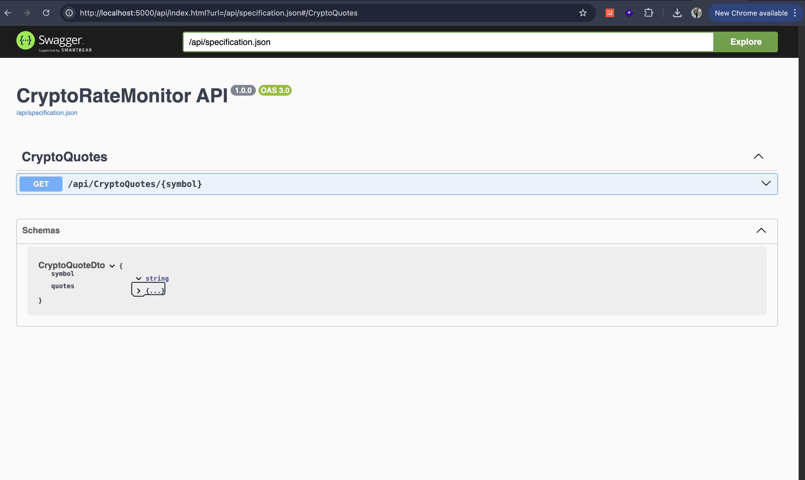
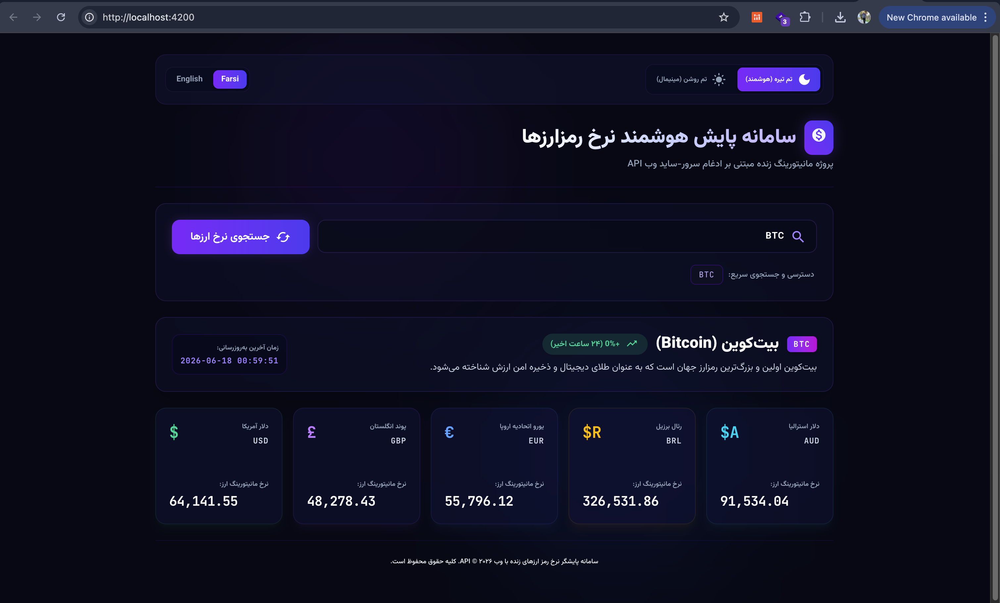

# CryptoRateMonitor


### Overview

`CryptoRateMonitor` is a full-stack cryptocurrency rate monitoring project built with ASP.NET Core, Clean Architecture, SQL Server, and Angular. The backend fetches exchange-rate data from `exchangeratesapi.io`, calculates fiat quotes for the requested crypto symbol, and the Angular client in `src/Web/ClientApp` consumes the real backend API.

### Project Layout

- `src/Domain`: domain entities, value objects, and domain events.
- `src/Application`: use cases, validation, MediatR behaviours, and service contracts.
- `src/Infrastructure`: EF Core, Identity, SQL Server, and exchange-rate service implementation.
- `src/Web`: API endpoints, Swagger, Razor/SPA hosting, and web infrastructure.
- `src/Web/ClientApp`: Angular application.
- `tests/Application.UnitTests`: Application-layer unit tests.
- `tests/Application.FunctionalTests`: integration/functional tests for the Web API and pipeline.

### Prerequisites

- .NET SDK 8
- SQL Server reachable by the application
- Node.js `20.19+` or `22.12+` for Angular 21
- npm

If your default Node.js version is too old, temporarily prepend a newer Node installation:

```bash
export PATH="$HOME/.nvm/versions/node/v22.13.1/bin:$PATH"
```

### Database Configuration in appsettings

The application reads the database address from `src/Web/appsettings.json`:

```json
{
  "ConnectionStrings": {
    "DefaultConnection": "Server=localhost,1444; Database=CryptoRateMonitorDb; User Id=sa; Password=Password123; Trust Server Certificate=True;"
  }
}
```

To point the app at another database, update `ConnectionStrings:DefaultConnection` in that file or override it in `src/Web/appsettings.Development.json`. The server name, port, database name, user, and password must match your local SQL Server or SQL Server container.

Integration tests use their own connection string here:

```text
tests/Application.FunctionalTests/appsettings.json
```

### Exchange Rate API Configuration

The exchange-rate API key is read from:

```json
{
  "ExchangeRates": {
    "ApiKey": "YOUR_API_KEY"
  }
}
```

For real environments, prefer user-secrets, environment variables, or Key Vault instead of storing sensitive keys in source control.

### Run the Backend

From the repository root:

```bash
dotnet watch run --project src/Web/Web.csproj
```
by using dotnet watch run every thing will be run




The backend defaults to:

```text
http://localhost:5000
```

### Run the Frontend

The Angular app lives in `src/Web/ClientApp`:

```bash
cd src/Web/ClientApp
npm install
npm run dev
```

The frontend is available at:

```text
http://localhost:4200
```

`src/Web/ClientApp/proxy.conf.json` proxies `/api` requests to the backend at `http://localhost:5000`.

### Swagger URL

After starting the backend, Swagger UI is available at:

```text
http://localhost:5000/api
```

The OpenAPI/Swagger JSON document is available at:

```text
http://localhost:5000/api/specification.json
```

Example crypto quote endpoint:

```text
GET http://localhost:5000/api/CryptoQuotes/BTC
```

Example response:

```json
{
  "symbol": "BTC",
  "quotes": {
    "EUR": 50000,
    "USD": 55000,
    "GBP": 42500,
    "AUD": 82500,
    "BRL": 275000
  }
}
```

### Build and Test

Build the backend:

```bash
dotnet build src/Web/Web.csproj -p:SkipNSwag=True
```

Build the frontend:

```bash
cd src/Web/ClientApp
npm run build
```

Lint and test the frontend:

```bash
cd src/Web/ClientApp
npm run lint
npm test -- --watch=false
```

Run Application unit tests:

```bash
dotnet test tests/Application.UnitTests/Application.UnitTests.csproj
```

Run integration/functional tests:

```bash
dotnet test tests/Application.FunctionalTests/Application.FunctionalTests.csproj
```

To use a temporary Testcontainers SQL Server instead of the appsettings connection string:

```bash
USE_TESTCONTAINERS=true dotnet test tests/Application.FunctionalTests/Application.FunctionalTests.csproj
```

### Troubleshooting

- If Angular reports an unsupported Node.js version, upgrade Node to `20.19+` or `22.12+`.
- If the quote endpoint returns `429 Too Many Requests`, the external exchange-rate provider has rate-limited the API key.
- If database startup fails, verify `src/Web/appsettings.json` and make sure the SQL Server port is reachable.
- If Swagger does not open, confirm the backend is running on `http://localhost:5000`.
